### Лабораторная работа №4

С помощью программного пакета [Apache JMeter](http://jmeter.apache.org/)
провести нагрузочное и стресс-тестирование веб-приложения в соответствии
с вариантом задания.

В ходе нагрузочного тестирования необходимо протестировать 3 конфигурации
аппаратного обеспечения и выбрать среди них наиболее дешёвую, удовлетворяющую
требованиям по максимальному времени отклика приложения при заданной нагрузке
(в соответствии с вариантом).

В ходе стресс-тестирования необходимо определить, при какой нагрузке выбранная
на предыдущем шаге конфигурация перестаёт удовлетворять требованиями по
максимальному времени отклика. Для этого необходимо построить график
зависимости времени отклика приложения от нагрузки.

> Приложение для тестирования доступно только во внутренней сети кафедры.

> Если запрос содержит некорректные параметры, сервер возвращает HTTP 403.

> Если приложение не справляется с нагрузкой, сервер возвращает HTTP 503.

**Webapp properties:**

- First hardware configuration ($ 1400) URL - http://stload.se.ifmo.ru:8080/?token=468606778&user=2023800600&conf=1;
- Second hardware configuration ($ 2500) URL - http://stload.se.ifmo.ru:8080/?token=468606778&user=2023800600&conf=2;
- Third hardware configuration ($ 3300) URL - http://stload.se.ifmo.ru:8080/?token=468606778&user=2023800600&conf=3;
- Maximum parallel sessions count - 12;
- Load average (requests per minute; per session) - 40;
- Maximum request processing timeout - 690 ms.

**Отчёт по работе должен содержать:**

1. Текст задания.
2. Описание конфигурации JMeter для нагрузочного тестирования.
3. Графики пропускной способности приложения, полученные в ходе нагрузочного
   тестирования.
4. Выводы по выбранной конфигурации аппаратного обеспечения.
5. Описание конфигурации JMeter для стресс-тестирования.
6. График изменения времени отклика от нагрузки для выбранной конфигурации,
   полученный в ходе стресс-тестирования системы.
7. Выводы по работе.

## Report
### Description of the JMeter configuration for load testing
The JMX test plan is a xml file, so the configuration description can be given in two forms: gui screenshots or xml. Since xml and readability are antonyms, screenshots will be given as an example.

At the top level of the **ThreadGroup** are objects describing the number of users (**Number of Threads**) and the number of test runs (**Loop Count**). They differ from each other only by the configuration number, so further examples of only the first group will be given.

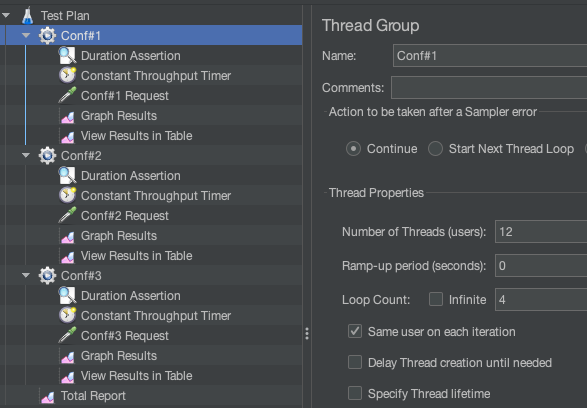
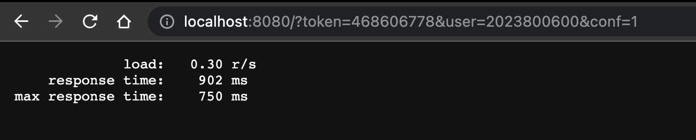

The top-level **Aggregate Report** element collects the test results into a csv file, from which an html report can be generated.
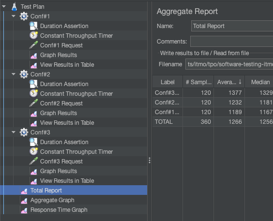

**HTTP Request** – makes requests to the test server.
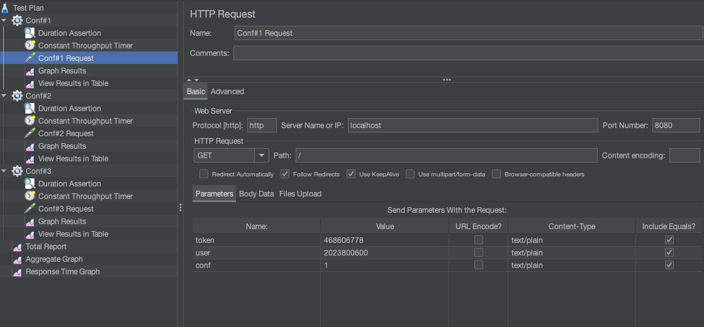

**Duration Assertion** – checks the server response time.
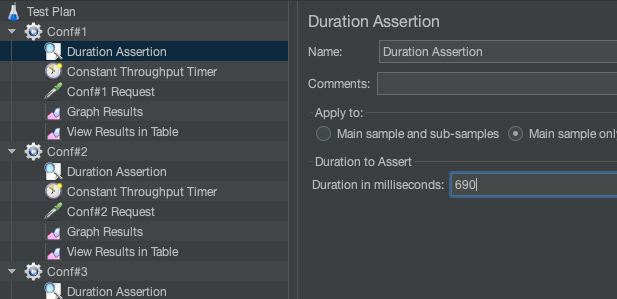

**Constant Output Timer** – determines the average load generated by one user per minute.
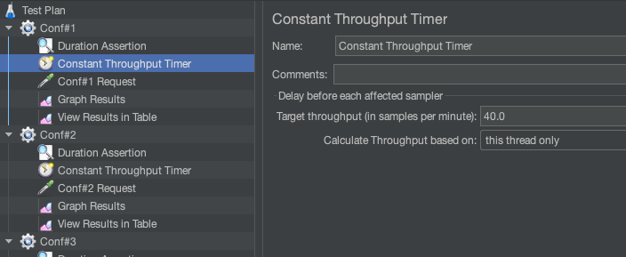

**View Results in Table** and **Graph Results** display the test results as a table and graph, respectively.
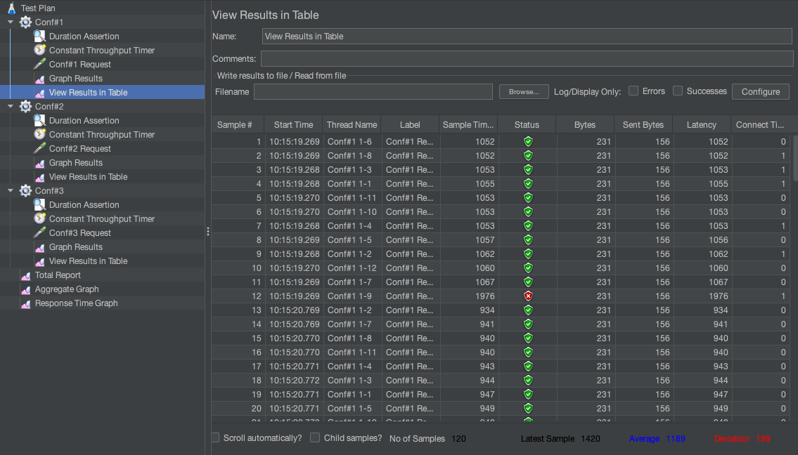
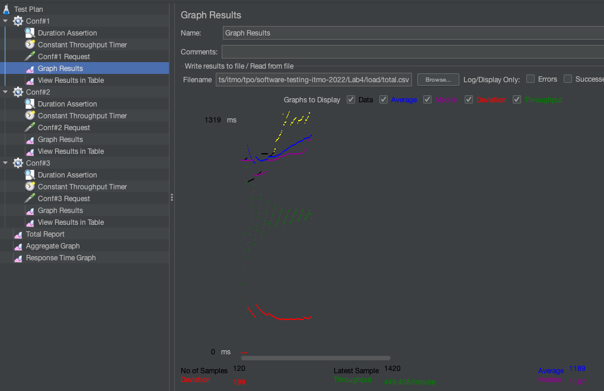

Application throughput graphs reports obtained during load testing
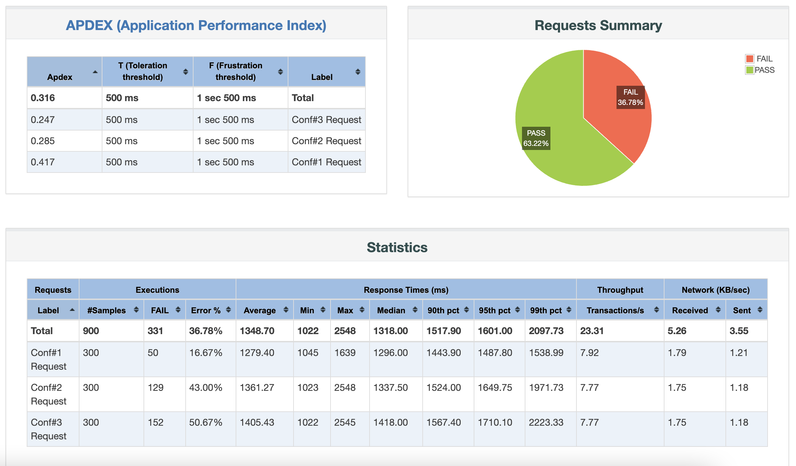
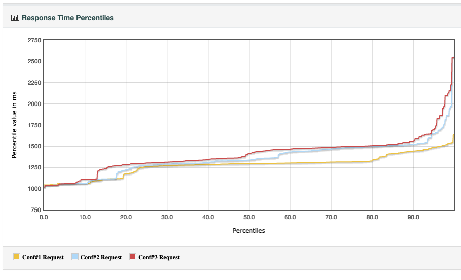
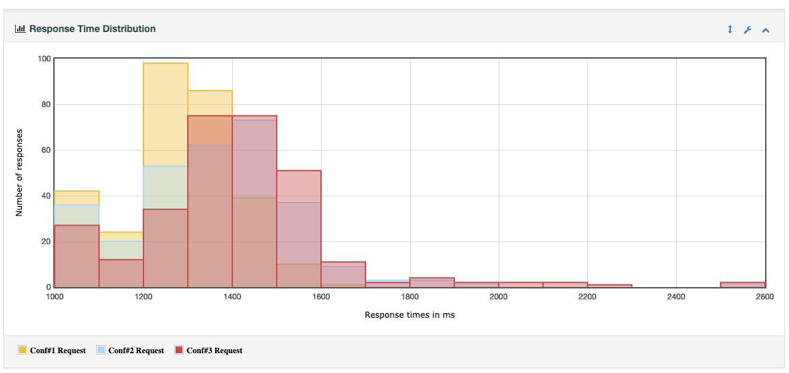

In general, the testing server is extremely weak, and 690ms (my variant) is a very much underestimated time. I had to set the timeout to 1400ms because, the most common mistakes are precisely in time.

### Conclusions on the selected hardware configuration
For load testing, let's see to the graphs of the response time and amount of errors in table. 
On them, we can see that in the max time response set by the variant and 12 users at the same time, 
We can see that the 1st configuration has the less amount of error and the most stable and effective 
response time, also this hardware configuration is the cheapest comparing to the other ones.

### Description of the JMeter configuration for stress testing.
The first configuration was chosen for stress testing. **Duration Assertion** can be removed, because we already know from past testing that even with 12 users, the time frame will barely be observed.
Now it will be necessary to change the parameter of the number of users until the server starts returning the error *503 - Service unavailable*.

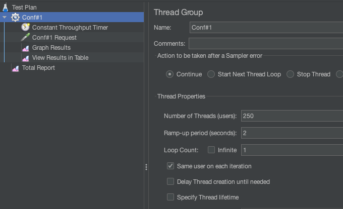
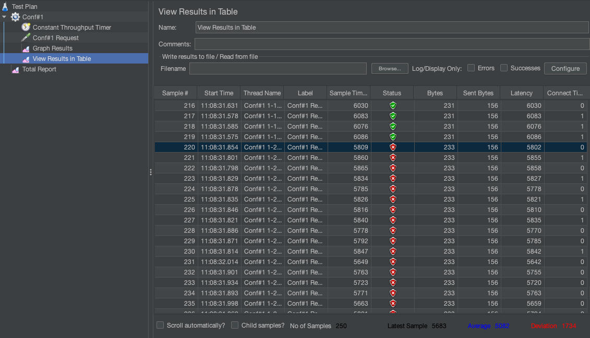

A graph of changes in the response time from the load for the selected configuration, obtained during stress testing of the system.
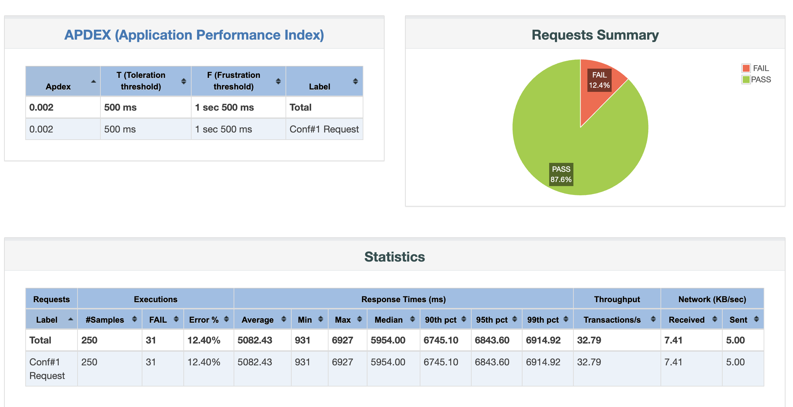
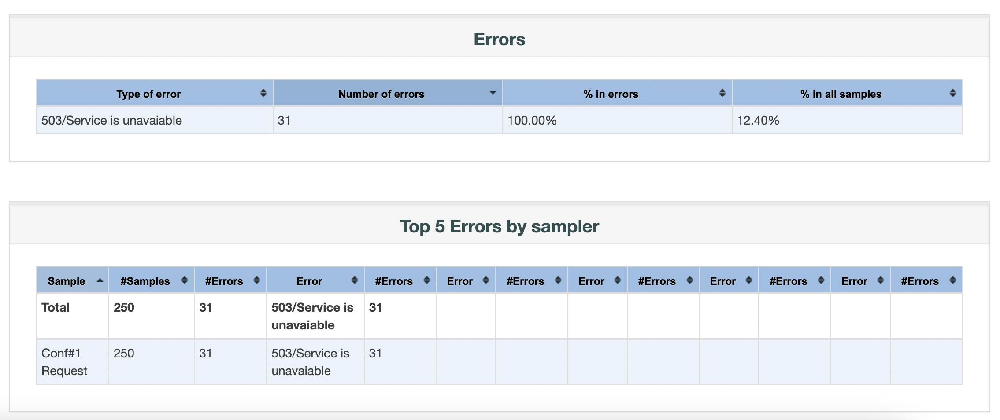
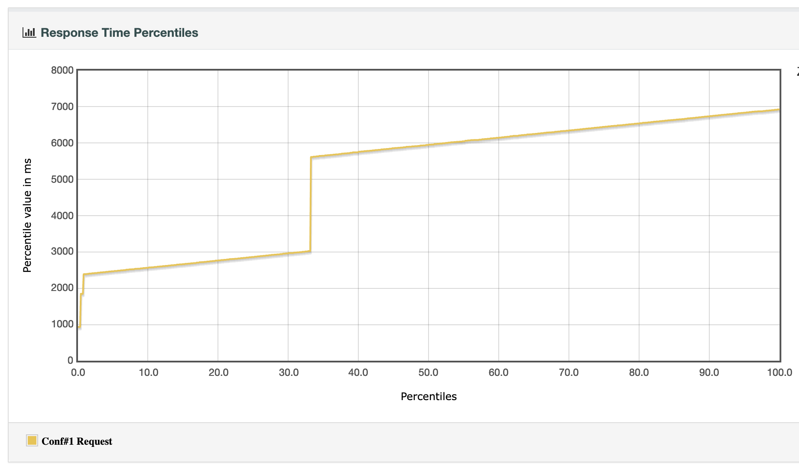
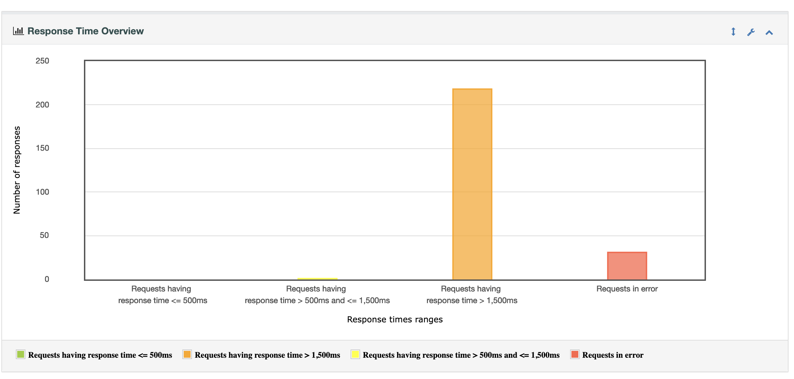
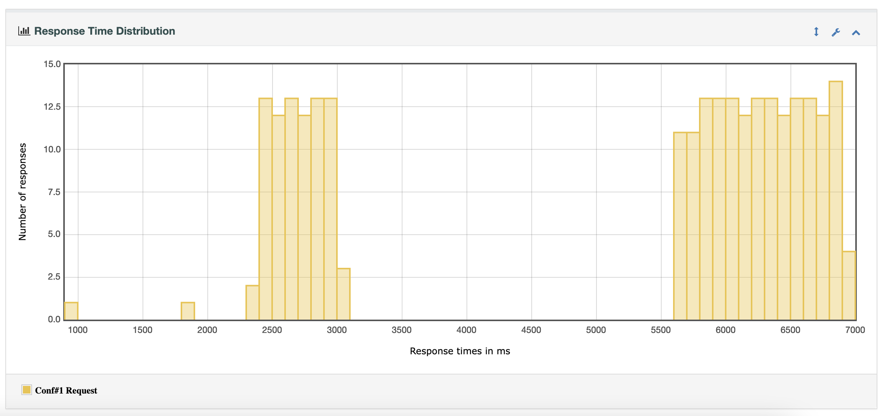

### Conclusion based on the selected hardware configuration (first)
It turned out to be very easy to “take down” the server. The server is cheap, and therefore it can not even achieve the 
response time expected by the variant (690ms). After testing with different amount of user, the server started dying in the
user 219. that means that during that test of 250 users, 31 of them got 503 error. We can also see that the 
average response time changed abruptly after 83 users, making the response time more than 6 seconds! pretty 
high for any server.

### Conclusion
During the laboratory work, load and stress testing was carried out by the server, in order to identify the cheapest configuration that meets the requirements. 
JMeter is a convenient and flexible tool for performing load testing. As a result of the laboratory work, the first hardware configuration was selected that meets the requirements and at the same time has the lowest cost.
